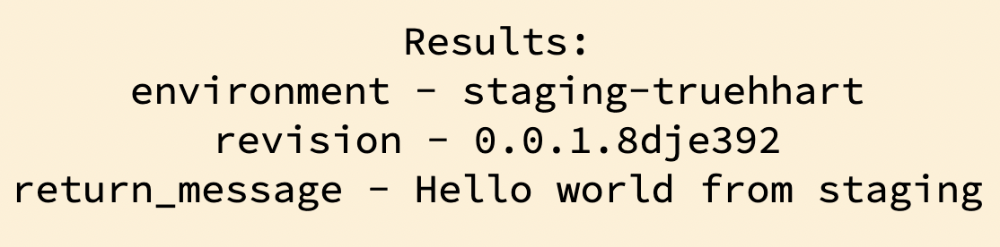

# Azure Pipelines Demo
## Introduction
This demo aims to showcase the CD functionality available through *Microsoft Azure DevOps*. The following resources are used in the scope of the project:
1. **Azure DevOps Pipelines.**
    > The whole project is centered around the Pipelines feature avaiable through Azure DevOps. Infrastructure deployment, application build and eventual release - all of those are managed using Pipelines .yaml files.
2.  **Azure Resource Manager (ARM).**
    >  All of the infrastructure is deployed using the ARM templates. Personally, I am typical Terraform enjoyer, but by using ARM we can stay true to the complete development toolset available through Azure.
3. **Azure Infrastructure.**
    > We are using a couple of infrastructure resources available through Azure.
    
    3.1. **Azure Resource Groups (RG).**
      > Azure Resource Groups are great for both functional and logical sepration of your azure resources. Throughout the project we'll be creating 3 RGs - the management one, staging and production. Management RG will be responsible for hosting shared resources, while the other to will host the respective environments.
    
    3.2. **Azure Container Registry (ACR).**
      > ACR is a built-in Container Registry service provided by Azure. One of the benefits of using a managed resource like this would be the capability to utilize service roles for access, as describe further.
    
    3.3. **Azure App Service Plans.**
      > These are used to define the compute resources needed to run an Azure App Service instance. Depending on the Plan selected, a different OS, region, Compute sizes, etc. will be provided to your App Service. We'll be utilizing App Service Plans because we plan to use the App Service feature for hosting our application.
    
    3.4. **Azure App Service.**
      > Azure App Service feature allows us to host Web Applications directly within Azure-provided infrastructure without the necessity of deploying and managing our own Virtual Machines. In our case - an App Service will be hosting a Docker container that's built with the our project application.
    
    3.5. **Azure Managed Identities.**
      > Azure Managed Identity is an IAM mechanism that allows us to define access scopes between resources by using Roles. These can be custom, but Azure provides a lot of built-in roles on their own. We'll be using Azure Managed Identities to allow our App Service access to the container registry.

Our pipelines will be deploying the application to **2 environments** - the **staging** and **production** one.

We'll be deploying a simple web application written in Go. It's main goal is to serve a static `/assets/index.html` page and provide us with information about the current build/deployment.

The **"Click Me!"** button on the webpage fetches the `/api/helloworld` route, which returns a simple json object with the deployment information. It's then represented in the **"Results"** section.



## Pre-requisites
The main goal of the project was to automate everything as much as possible. Still, there is some manual configuration that needs to be done before you can start deploying.
1. You need to have **an active Azure Subscription** and an **Azure DevOps account**.
    - Azure provides **Free Tier resources** and **a 200$ credit** as a "free trial" when you first sign up with a new subscription.
        - *Note that this offer is valid for 1 month only*.
    - Azure DevOps has **1800 pipeline minutes** available within the "free tier". 
        - *Only minutes ran on the Azure-hosted agents count towards this limit.*
        - *If you just created an account - you may need to reach out to Azure to enable Azure-hosted agents, as they've been disabled for new users by default at the time of me doing this project.*
        - *You can use a self-hosted agent for the pipelines, it will do just fine. Make sure to change the pipelines in that case.*
2. You need to establish **a Service Connection between your Azure Subscription and DevOps account**. This can be done in the Project Settings of Azure DevOps. 
    - ***!IMPORTANT!** Within our infrastructure deployments - we'll be assigning Roles to the Managed Identities on the resource level. This operation requires resource Owner role for the Service Connection, so make sure to add it manually after creating the Service Connection (SC). Least available Owner scope would be to assign the SC as the Owner of your ACR.*
3. You need to establish **a connection between Azure DevOps and your code repository**.

## Implementation Guide
1. Once you have prepared everything following the [pre-requisites](#pre-requisites) section, you will need to create the pipelines in the Azure DevOps. This can be done either manually or via the az-cli (I would heavily recommend this tool for troubleshooting if you are not using it yet).
    > NOTE: az pipelines module will evaluate your current folder context for git metadata. This metadata will be used as a branch reference for pipeline create/run commands - so make sure to changedir into your checkout folder beforehand.
    ```sh
    # Example "create-pipeline" command. 
    # Make sure to adjust the values 
    az pipelines create \
      --name 'run-production-deployment' \
      --description 'This pipeline deploys the build artifact to the production' \
      --repository 'truehhart/azureapp' \
      --project 'azureapp' \
      --repository-type 'github' \
      --yaml-path 'ci/azureapp/run-production-deployment.yml' \
      --skip-first-run
    ```
2. Run the 'prepare-management-infrastructure' Pipeline. It will create the Management Resource Group and the ACR which will be hosting the containers.
3. Run the 'prepare-azureapp-infrastructure' for your staging and production environments.
    ```sh
    # Make sure to check the default parameter values and adjust the pipelines to your deployment.
    # Azure doesn't allow duplicate names across their whole system - chances are that names specified here will be taken.
    az pipelines run \
      --name 'prepare-azureapp-infrastructure' \
      --parameters 'environment=prod'
    ```
4. By this step - all of the needed infrastructure is created. You can just run the 'build-azureapp-on-changes' pipeline or make any changes to the source code of the go application. This will start the whole CD cycle - first the application will be deployed to staging, then - we'll run some tests and once they succeed - a production deployment will begin.
5. Once the deployment finishes - you can find the link to the "staging" and "production" applications within their respective pipelines (the '\[Outputs\] Echo the WebApp url' task).

## Personal thoughts
I wanted to share my 2 cents on the whole Azure/Azure DevOps/ARM story, coming from the AWS/Jenkins/Terraform standpoint. 
- **Azure DevOps** is definitely the best product out of all three. It's great for **basic CI/CD pipelines** and is a **good platform to "start with" as a beginner**. The "tasks" system is great because it allows for simple implementation of well-known scenarios into your pipeline. **I would definitely consider this for working on simple projects** that don't require too much control over your pipelines. Nonetheless, Jenkins provides way more functionality and customization options, so if you are working on a complicated project - Azure DO may not be the best solution.
- **Azure Resource Manager Templates**. In my honest opinion - ARM Templates have a lot of problems and if you wish to use ARM as your main IaC solution - you have to be ready to tackle them. I guess they deserve their own bulletpoints:
    - First and foremost - ARM templates are both complicated to write and read. Resource definitions, references - all of this requires ARM functions and syntax that you **have** to be familiar with in order to use properly. And then comes the second problem:
    - The documentation on ARM Template resources and functions is a mess. Every definition in ARM template has it's own apiVersion. Resources are configured differently based on the apiVersion you want to use - and it's just hard/sometimes impossible to find the corresponding documentation on the Microsoft Docs. You will sometimes need to rely on people asking questions on the internet/providing github snippets to solve the most basic of tasks.
    - ARM Template deployments are not stateful, they just follow the current template you provide them with. You can use the "Complete" deployment mode to delete everything from deployment scope that's not defined in the current template - but I would honestly be afraid to use that in production due to the possibility of necessary resources being deleted from the resource group. So unless you create a new resource group for every single infrastructure resource - it's impossible to correct any sort of "configuration drift" and remove "leftover" deployments.
- **Azure Cloud Service** - I've had experience with Azure in the past and it's just like I remembered it. I don't have much to say about it - I guess the main thing I like about Azure is it's Resource Groups. It's a great concept to use in production for separating your resources logically/functionally. One thing that baffles me to this day though - why does UI have to be this slow still?..

That's it! I hope this might help someone and if anything - feel free to hit me up with any questions at d.parshenkov@truehhart.com. Cheers!